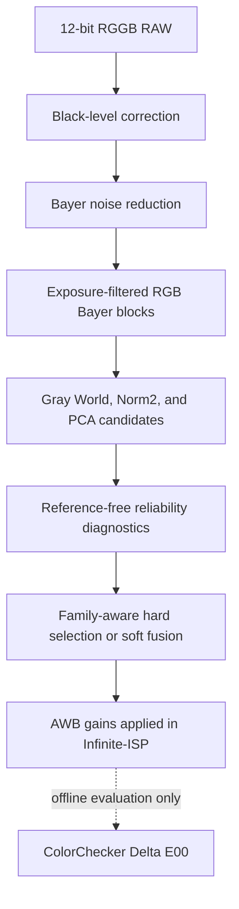
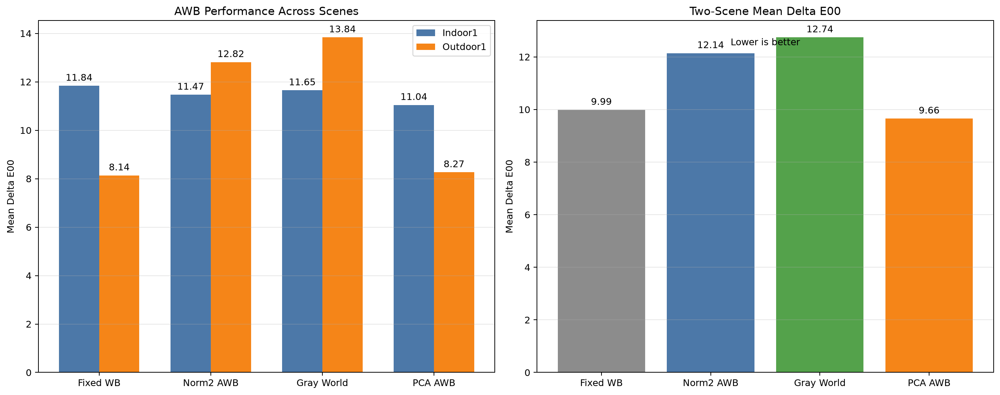
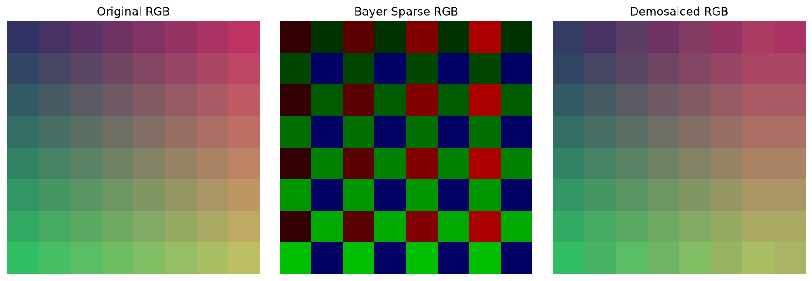
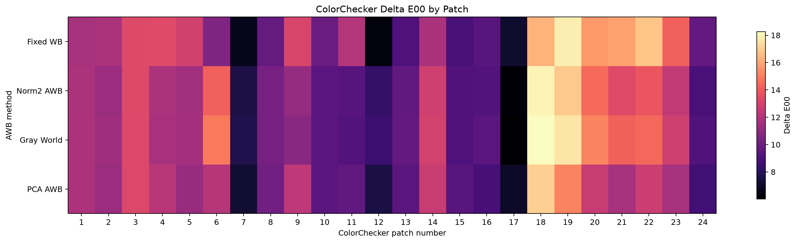
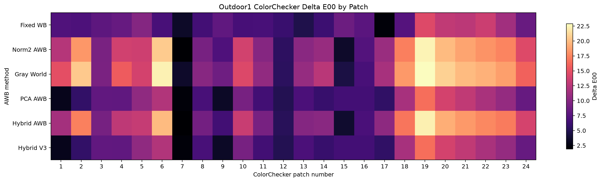

# Mobile ISP Lab

A hands-on image signal processing project covering Bayer-domain image reconstruction, automatic white balance evaluation, and reliability-aware AWB fusion.

## Overview

This project studies key stages of a mobile camera image signal processing pipeline through reproducible Python experiments.

The work contains two main parts:

1. **Bayer CFA and demosaicing**
   - Bayer pattern visualization
   - Bilinear and edge-aware demosaicing experiments
   - Pixel-wise error maps and quantitative reconstruction metrics

2. **Automatic white balance**
   - Reproduction of Gray World, Norm2 Gray World, and PCA illuminant estimation
   - Alignment with the black-level correction, Bayer noise reduction, and exposure filtering used by Infinite-ISP
   - ColorChecker evaluation using CIEDE2000
   - Development of a reference-free, reliability-aware Hybrid AWB V3

The proposed Hybrid V3 uses neutral-pixel support, highlight clipping risk, spatial stability, bright-tail evidence, and algorithm-family-aware fusion to decide between AWB candidates. On the current Indoor1 and Outdoor1 evaluation scenes, it reduced the two-scene mean Delta E00 from **11.833** for the previous Hybrid method to **9.721**, a **17.85% reduction**, while remaining within **0.67%** of the best single candidate, PCA AWB.

This repository is an experimental and educational ISP study rather than a production camera pipeline. The AWB experiments use Infinite-ISP as the reference processing environment.

## Project Highlights

- Implemented and visualized Bayer-domain sampling and demosaicing.
- Analyzed reconstruction quality using MAE, MSE, RMSE, PSNR, and error maps.
- Reproduced three classical AWB candidates with gains matching Infinite-ISP outputs.
- Evaluated AWB quality on 24-patch ColorChecker regions using Delta E00.
- Identified same-family voting bias between Gray World and Norm2.
- Designed a family-aware Hybrid AWB that supports both hard selection and soft fusion.
- Demonstrated a substantial reduction in the failure of the previous Hybrid method on Outdoor1.
- Reported both improvements and limitations without tuning the selector directly against ColorChecker ground truth.

## Repository Structure

| Path | Purpose |
|---|---|
| `scripts/visualize_bayer.py` | Bayer CFA visualization, demosaicing experiments, and reconstruction-error analysis |
| `scripts/compare_infinite_isp_awb.py` | Comparison of fixed white balance and classical Infinite-ISP AWB outputs |
| `scripts/analyze_awb_candidates.py` | Candidate reproduction, reference-free diagnostics, reliability scoring, and Hybrid V3 fusion |
| `scripts/evaluate_colorchecker.py` | Indoor1 ColorChecker ROI sampling and Delta E00 evaluation |
| `scripts/evaluate_outdoor_awb.py` | Outdoor1 AWB comparison and ColorChecker evaluation |
| `scripts/compare_awb_across_scenes.py` | Cross-scene summary, worst-scene analysis, and visualization |
| `results/` | Generated figures and CSV evaluation results |
| `requirements.txt` | Direct Python dependencies |
| `requirements-lock.txt` | Frozen dependency versions for reproducibility |

## Technical Workflow



The candidate analyzer follows the same relevant preprocessing stages as Infinite-ISP. Black-level offsets are removed from the RAW Bayer image, and the original Infinite-ISP joint bilateral filter is used for Bayer noise reduction. Each adjacent RGGB block is then represented as one statistical RGB sample, with the two green measurements averaged together.

Samples are excluded from AWB estimation when any channel falls below the underexposure threshold or exceeds the overexposure threshold. This keeps dark noise and saturated responses from dominating the illuminant estimates.

## AWB Candidates

| Method | Gain estimation | Role |
|---|---|---|
| Fixed WB | Manually configured red and blue gains | Non-adaptive reference baseline |
| Gray World | `mean(G) / mean(R)` and `mean(G) / mean(B)` | Global first-order color statistic |
| Norm2 Gray World | `norm(G) / norm(R)` and `norm(G) / norm(B)` | Gray World variant with stronger emphasis on high-intensity samples |
| PCA AWB | Ratios derived from the principal RGB direction of selected dark and bright samples | Distribution-based illuminant estimator |

Gray World and Norm2 are closely related because both estimate the illuminant from global channel statistics. Treating them as two independent voters can therefore give one algorithm family disproportionate influence.

## Reliability-Aware Hybrid AWB V3

Hybrid V3 evaluates the candidates without using ColorChecker labels or reference Lab values. Its diagnostic evidence includes:

- candidate gain disagreement;
- neutral-pixel support;
- neutral-tail residual;
- highlight clipping risk;
- spatial gain stability across image tiles;
- fixed bright-tail neutrality;
- bright-region color diversity.

The method first combines Gray World and Norm2 inside a **Gray-family** representation. Their gains are fused in the log-gain domain so that the related methods contribute as one top-level family rather than two independent votes.

The top-level decision then compares the Gray family with PCA:

- **Hard family selection** is used when candidate disagreement is sufficiently large and one family has a clear reliability-score advantage.
- **Soft family fusion** is used when the evidence is less decisive.

The selector never observes Delta E00 during inference. ColorChecker measurements are used only after rendering to evaluate whether the reference-free decision produced accurate colors.

## Experimental Setup

The AWB experiments use two 2592 x 1536, 12-bit RGGB RAW scenes from the Infinite-ISP sample data:

- **Indoor1**, representing an indoor illumination condition;
- **Outdoor1**, representing an outdoor illumination condition.

Both scenes contain a visible 24-patch ColorChecker used only for offline color-accuracy evaluation.

The evaluated methods are Fixed WB, Norm2 AWB, Gray World, PCA AWB, the previous Hybrid AWB, and Hybrid V3.

For each rendered output, RGB values are sampled from fixed regions near the centers of the 24 ColorChecker patches. The sampled colors are converted to Lab and compared with ColorChecker reference values using CIEDE2000. Lower Delta E00 indicates better color accuracy.

The evaluation reports:

- mean and median Delta E00 across all 24 patches;
- mean Delta E00 for chromatic patches 1-18;
- mean Delta E00 for neutral patches 19-24;
- maximum Delta E00 and the worst patch;
- two-scene mean and worst-scene performance.

## Quantitative Results

| Method | Indoor1 mean Delta E00 | Outdoor1 mean Delta E00 | Two-scene mean | Worst-scene score |
|---|---:|---:|---:|---:|
| Fixed WB | 11.839 | **8.137** | 9.988 | 11.839 |
| Norm2 AWB | 11.470 | 12.816 | 12.143 | 12.816 |
| Gray World | 11.651 | 13.838 | 12.745 | 13.838 |
| PCA AWB | **11.045** | 8.267 | **9.656** | **11.045** |
| Previous Hybrid AWB | 11.335 | 12.331 | 11.833 | 12.331 |
| Hybrid V3 | 11.174 | 8.267 | 9.721 | 11.174 |



## Result Interpretation

Hybrid V3 reduced the two-scene mean Delta E00 from **11.833** to **9.721** compared with the previous Hybrid method. Its worst-scene score also improved from **12.331** to **11.174**.

On Outdoor1, the candidate gains disagreed strongly and the bright-tail evidence favored PCA. Hybrid V3 therefore performed hard family selection and reproduced the PCA result, avoiding the substantial degradation produced by the previous soft fusion.

On Indoor1, the family scores were close, so Hybrid V3 used soft fusion. Its mean Delta E00 was 11.174, compared with 11.045 for PCA. This small difference illustrates an important limitation: reference-free reliability scores cannot directly predict the ColorChecker error of a fused result.

PCA remains the best single automatic method on the current two-scene dataset. The main contribution of Hybrid V3 is therefore not a claim of universal superiority, but a more reliable fusion strategy that identifies high-risk disagreement and prevents severe cross-scene failure.

## Installation

Create and activate a Python virtual environment:

```bash
python -m venv .venv
source .venv/bin/activate
```

Install the direct project dependencies:

```bash
python -m pip install -r requirements.txt
```

`requirements-lock.txt` records the complete package versions used for the reported experiments.

## External Prerequisite

The AWB experiments require a compatible local checkout of Infinite-ISP. The current scripts expect it at:

```text
/workspace/infinite-isp-baseline
```

The required Indoor1 and Outdoor1 RAW files are expected under:

```text
/workspace/infinite-isp-baseline/in_frames/normal/data
```

The candidate analyzer imports Infinite-ISP's original `JointBF` implementation so that its Bayer noise reduction matches the reference pipeline.

The evaluation scripts also read pre-rendered PNG files from the Infinite-ISP `out_frames` directory. Their expected filenames are defined near the beginning of each evaluation script. If the Infinite-ISP repository or rendered outputs are stored elsewhere, update these paths before running the evaluation.

## Reference Baseline and Attribution

This repository is an independent educational and experimental study that uses the open-source [Infinite-ISP](https://github.com/10x-Engineers/Infinite-ISP) project by 10xEngineers as a separately checked-out reference ISP pipeline.

During development, `mobile-isp-lab` and Infinite-ISP are maintained as separate repositories. This repository does not fork, vendor, or redistribute Infinite-ISP source code. The classical Gray World, Norm2 Gray World, and PCA AWB candidates were independently reimplemented after studying the corresponding Infinite-ISP modules, with their preprocessing sequence and gain calculations intentionally aligned to the reference pipeline. The candidate analyzer also imports Infinite-ISP's original `JointBF` implementation from a compatible local checkout at runtime so that Bayer noise reduction matches the reference pipeline.

Infinite-ISP is used to:

- align black-level correction, Bayer-domain noise reduction, exposure filtering, and candidate-gain calculations;
- render final Hybrid AWB gains through an Infinite-ISP configuration with `render_3a: false`;
- compare reproduced candidate gains against reference-pipeline outputs.

The candidate-analysis workflow, reliability diagnostics, family-aware Hybrid AWB V3 fusion logic, ColorChecker evaluation, visualizations, experiment design, and documentation in this repository were developed independently for this project.

Users should clone and configure Infinite-ISP separately. Infinite-ISP and any RAW input data remain subject to their respective licenses and usage terms.

## License

The original code and documentation in this repository are released under the [MIT License](LICENSE).

The MIT License applies only to the original work in this repository. Infinite-ISP is an external dependency and remains subject to its own [Apache-2.0 license](https://github.com/10x-Engineers/Infinite-ISP/blob/main/LICENSE).


## Usage

### Bayer and demosaicing experiment

```bash
python scripts/visualize_bayer.py
```

This generates the Bayer-pattern, demosaicing-comparison, and reconstruction-error figures in `results/`.

### Baseline AWB comparison

```bash
python scripts/compare_infinite_isp_awb.py
```

This compares the prepared Fixed WB, Norm2, Gray World, and PCA output images for Indoor1.

### Candidate analysis and Hybrid V3 gains

Analyze Outdoor1:

```bash
python scripts/analyze_awb_candidates.py --scene Outdoor1
```

Analyze Indoor1:

```bash
python scripts/analyze_awb_candidates.py --scene Indoor1
```

The analyzer prints the reproduced candidate gains, diagnostic evidence, reliability scores, family weights, decision mode, and final Hybrid V3 gains.

The reported Hybrid gains must then be applied through an Infinite-ISP configuration with `render_3a: false`. The analyzer does not automatically render the final image.

### ColorChecker evaluation

After the required Infinite-ISP output images have been generated and placed under `out_frames`, run:

```bash
python scripts/evaluate_colorchecker.py
python scripts/evaluate_outdoor_awb.py
python scripts/compare_awb_across_scenes.py
```

The first two scripts generate scene-level ColorChecker Delta E00 results. The final script reads those CSV files and produces the cross-scene comparison.

## Reproducibility Notes

- ColorChecker ROI coordinates are fixed separately for Indoor1 and Outdoor1.
- The evaluation scripts currently use explicit Infinite-ISP output filenames.
- Hybrid V3 selection itself is reference-free, but the reported Delta E00 evaluation requires visible ColorChecker patches.
- The generated PNG and CSV files used in the reported experiment are included in `results/`.

## Limitations

- The quantitative evaluation currently contains only two scenes, so the reported results are not sufficient to establish broad generalization.
- The ColorChecker ROIs are manually configured for the two evaluated images.
- The reliability-score weights and decision thresholds have not been calibrated on a larger independent validation set.
- A ColorChecker Delta E00 score measured after the complete ISP pipeline is influenced by exposure, color correction, gamma, and other downstream processing in addition to AWB.
- The current evaluation scripts depend on explicit external paths and pre-rendered Infinite-ISP outputs.
- `analyze_awb_candidates.py` is a detailed experimental analysis script and has not yet been separated into smaller production-oriented modules.

## Future Work

- Evaluate more indoor, outdoor, mixed-illumination, and dominant-color scenes.
- Use bootstrap or tile-resampling confidence to decide more rigorously between hard selection and soft fusion.
- Add illuminant angular-error evaluation when ground-truth illuminants are available.
- Automate the transfer of Hybrid gains into Infinite-ISP and the rendering of final outputs.
- Replace hard-coded paths and ROI coordinates with command-line configuration files.
- Refactor candidate generation, reliability diagnostics, and fusion logic into reusable modules.
- Investigate automatic ColorChecker detection for scalable evaluation.

## Selected Outputs

### Demosaicing comparison



### Indoor1 Delta E00 by patch



### Outdoor1 Delta E00 by patch



